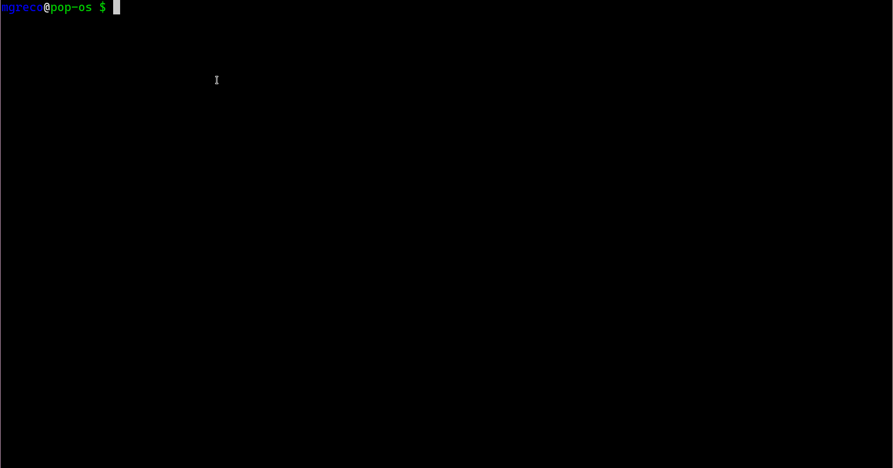

## Better git stash workflow




Sometimes, while working, I stash changes to switch to another branch or
something similar, make some changes there, stash again, and then want my
changes back. This is when everything becomes slow. It's not the most common
practice, but when it occurs, it's quite a hassle.

I find myself having to list stashes, diff stashes against my branch to
identify the correct stash (I don't use messa ges and the default message is
rarely useful).

So, I've tried to streamline my workflow with a bash script:

It was fun creating it, here is the script:

[`fzf-stash`](https://github.com/mmngreco/dotfiles/blob/1b330ff87328993bf75e3a2f486f10a0e39a31ba/ubuntu/bin/fzf-stash)

```
1   #!/usr/bin/env bash
2
3   if command -v bat >/dev/null 2>&1; then
4       # use bat
5       show_preview='echo {} | awk -F":" "{print \$1}" | xargs -I {} sh -c "git stash show -p {} > /tmp/stash-preview && bat --color=always /tmp/stash-preview"'
6       list_preview='echo {} | awk -F":" "{print \$1}" | xargs -I {} sh -c "git stash show --name-only {} > /tmp/stash-preview && bat --color=always /tmp/stash-preview"'
7       diff_preview='echo {} | awk -F":" "{print \$1}" | xargs -I {} sh -c "git diff $FZF_STASH_DIFF {} > /tmp/stash-preview && bat --color=always /tmp/stash-preview"'
8   else
9       # not use bat
10      show_preview='echo {} | awk -F":" "{print \$1}" | xargs -I {} git stash show -p {}'
11      list_preview='echo {} | awk -F":" "{print \$1}" | xargs -I {} git stash show --name-only {}'
12      diff_preview='echo {} | awk -F":" "{print \$1}" | xargs -I {} git diff $FZF_STASH_DIFF {}'
13  fi
14
15  case $1 in
16      s|show)
17          preview=${show_preview}
18          ;;
19      ls|list)
20          preview="${list_preview}"
21          ;;
22      d|diff)
23          if [ -z "$2" ]; then
24              echo "Usage: $0 diff <branch>"
25              exit 1
26          fi
27          export FZF_STASH_DIFF=$2
28          preview=${diff_preview}
29          ;;
30      h|help)
31          echo "Usage: $0 <command>"
32          echo "Commands:"
33          echo "  h, help               show this help"
34          echo "  s, show (or empty)    show stash diff"
35          echo "  ls, list              list stash files"
36          echo "  d, diff <commit-ref>  diff stash with branch"
37          exit 1
38          ;;
39      *)
40          preview=${show_preview}
41  esac
42
43  stashes=$(git stash list | fzf --multi --preview "$preview" --preview-window=right:70%:wrap)
44
45  if [ -n "$stashes" ]; then
46      echo "$stashes" | awk -F: '{print $1}' | while read stash; do
47          git stash apply "$stash"
48      done
49  fi

```


## Dissecting the script

The main goals are:

1. Show the content of stashes interactively
2. Apply stashes interactively
3. Diff against branches interactively
4. [Extra] List files in the stash
5. [Extra] Get syntax highlight by using bat
6. [Extra] Keep working if bat is not installed

### Understanding the code

For the first point, all we need to get that done are the following lines (I
haven't tested but it should work):


```
10      show_preview='echo {} | awk -F":" "{print \$1}" | xargs -I {} git stash show -p {}'
..
43  stashes=$(git stash list | fzf --multi --preview "$preview" --preview-window=right:70%:wrap)
..
46      echo "$stashes" | awk -F: '{print $1}' | while read stash; do
47          git stash apply "$stash"
48      done
```

Let's dissect it. The first line is the command to show the content in the preview window of `fzf`. The first part re
turns only the stash reference. The last part basically executes `git stash show` using the selected stash in `fzf`.

```
10      show_preview='echo {} | awk -F":" "{print \$1}" | xargs -I {} git stash show -p {}'
```

The second line is the execution of `fzf` over all stashes using the preview command, and multiple selection with tab
 or space.

```
43  stashes=$(git stash list | fzf --multi --preview "$preview" --preview-window=right:70%:wrap)
```

Finally, the last 3 lines iterate over selected stashes (`stash@{0}`, `stash@{1}`,...) applying them. Easy peasy, isn
't it?

```
46      echo "$stashes" | awk -F: '{print $1}' | while read stash; do
47          git stash apply "$stash"
48      done
```

### Listing files

Now let's add more functionality, point 2:

```
11      list_preview='echo {} | awk -F":" "{print \$1}" | xargs -I {} git stash show --name-only {}'
```

The main difference is that now I'm using `git stash show --name-only`, which
gives us the file names only. Useful wh en we have stashes which involve many
files.


### Diff against other branches

```
12      diff_preview='echo {} | awk -F":" "{print \$1}" | xargs -I {} git diff $FZF_STASH_DIFF {}'
27          export FZF_STASH_DIFF=$2
```

This one is a little bit trickier, let's take a look at the `xarg` command
only:

```bash
git diff $FZF_STASH_DIFF {}
```

I had to use an environment variable to define the commit reference to compare
against as otherwise it wouldn't work. In my first attempt, I tried to use `$2`
but that reference doesn't exist in the preview execution environment.

### Fancy highlight


In my first iteration, I realized that I really needed syntax highlight so I
decided to use bat for that. So, the fir st if check if bat exists if it does
then use it writing a file first and reading it with bat after.


That's all.
