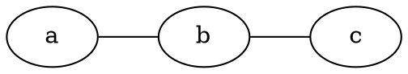

## Contexto

Siempre he buscado una manera simple de incorporar diagramas directamente desde
Neovim, pero nunca había encontrado una solución sencilla hasta hoy.

Hasta ahora, no tenía un método sencillo para incluir diagramas, así que
delegaba ese trabajo a documentación externa al código, usando Mermaid. Aunque
estaba satisfecho con los resultados, me preguntaba cómo podría hacerlo más
simple. La respuesta vino justamente de mi experiencia con Mermaid.

Anteriormente, había probado soluciones como `asciiflow` o `venn.nvim`, pero
implican más tiempo del que me gustaría y tomar muchas decisiones. ¿Cuánto
espacio dejo entre cajas? ¿Cuánto texto debo dividir en varias líneas? ¿Cómo de
largas deben ser las flechas? etc.

Usando mermaid me di cuenta que lo que es potente es que no tengo que tomar
ninguna desicion estetica (aunque es posible) sobre el diagram simplemente
escribir el contenido y mermaid se encarga de darme un output excelente.

Con este concepto en mente, inicié la exploración para crear un convertidor de
Mermaid a ASCII, pero rápidamente me decanté por esta solución:

👉 https://github.com/ggerganov/dot-to-ascii

Basicamente esta solución implica escribir el diagrama en `dot` y convertirlo a
ASCII. Realiza exactamente la misma función, está implementada y tiene API,
¿qué más se puede pedir?


## Implementación

Por lo tanto, empecé a implementar una solución para poder usarla desde Neovim:

Tan solo necesitamos un script simple en Python que realice la solicitud por
nosotros (en el propio proyecto nos dan uno script) y un comando Lua que haga
uso de este script para convertir el diagrama a ASCII.

```python
#!python3
"""
Examples
--------
$ pipx run https://gist.githubusercontent.com/mmngreco/2d3bc321405b1991277fd6001060df0d/raw/dot2ascii.py help
$ pipx run https://gist.githubusercontent.com/mmngreco/2d3bc321405b1991277fd6001060df0d/raw/dot2ascii.py "graph {a -- b -- c}"
$ echo "graph {rankdir=LR; a -- b -- c }" | pipx run https://gist.githubusercontent.com/mmngreco/2d3bc321405b1991277fd6001060df0d/raw/dot2ascii.py
"""
# /// script
# requires-python = ">=3.10"
# dependencies = [
#   "requests",
# ]
# ///

import requests

def dot_to_ascii(dot: str, fancy: bool = True):
    url = 'https://dot-to-ascii.ggerganov.com/dot-to-ascii.php'
    boxart = 0
    if fancy:
        # use nice box drawing char instead of + , | , -
        boxart = 1
    params = {
        'boxart': boxart,
        'src': dot,
    }
    response = requests.get(url, params=params).text
    if response == '':
        raise SyntaxError('DOT string is not formatted correctly')
    return response


def app():
    import sys
    if len(sys.argv) > 1:
        text = sys.argv[1]
        if text == "help":
            print("Usage: python main.py [dot_string]")
            sys.exit(0)
    else:
        text = sys.stdin.read()
    ascii = dot_to_ascii(text)
    print(ascii)


if __name__ == '__main__':
    app()
```

Y aqui el comando en `lua` para Neovim:

```lua
-- this is wrapper to convert dot graph to ascii art using pipx and a gist
-- https://gist.githubusercontent.com/mmngreco/2d3bc321405b1991277fd6001060df0d/raw/dot2ascii.py
local function dot2ascii(opts)
    local range = ''
    if opts.range ~= 0 then
        range = string.format("%s,%s", opts.line1, opts.line2)
    end
    vim.cmd(string.format(":%s!pipx run https://gist.githubusercontent.com/mmngreco/2d3bc321405b1991277fd6001060df0d/raw/dot2ascii.py", range))
end
vim.api.nvim_create_user_command('Dot2Ascii', dot2ascii, { range = true, nargs = 0 })
```


## Resultado

Ahora puedo escribir algo como lo siguiente en Neovim:




Seleccionando esas líneas del diagrama y ejecutando el comando `Dot2Ascii` que
he creado, este es el resultado:

```
┌───┐     ┌───┐     ┌───┐
│ a │ ─── │ b │ ─── │ c │
└───┘     └───┘     └───┘
```




