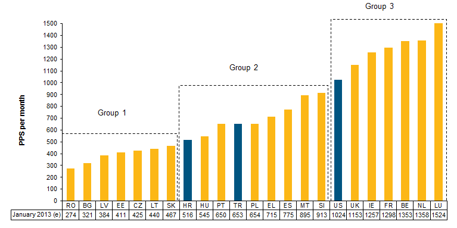

<!-- Title: Notas sobre el SMI -->
<!-- Date: 2013-12-20 -->
<!-- Modified: 2013-12-20 -->
<!-- Category: Economics -->
<!-- Tags: economics, wage, salary -->
<!-- Slug: Notas-sobre-el-smi -->
<!-- Authors: Maximiliano Greco -->

# Notas sobre el Salario Mínimo Interprofesional (SMI)

[**Artículo original de Econstuff**](http://econstuff.com/notas-sobre-el-salario-minimo-interprofesional-smi/)

## Aún circulan por la red cosas como éstas:

> _Francia subirá el IVA al 21,2 . Lo tenían al 19,6 . Nosotros lo tenemos al
> 18. SALARIO MÍNIMO: Francia 1321 , España 600. HAHAHAHAHAHAHAHAHA_
>
> — Vergüenza de País (@VERGUENZADEPAIS) [enero 30, 2012](https://twitter.com/VERGUENZADEPAIS/statuses/163783421464821760)
>
> _El salario mínimo en Francia es de 1.356€ (son ricos) En Grecia, de 739€
> (son pobres) Y, en España, de 641€ (directamente, somos GILIPOLLAS)_
>
> — David Bonilla (@david\_bonilla) [enero 11, 2012](https://twitter.com/david_bonilla/statuses/157017662579417088)

En un sentido estricto, estas afirmaciones no son correctas -por un tema de
pagas anuales, que no están estandarizadas-, aunque puede que nos os convenza
dado que poco cambia las conclusiones, sí que es interesante cuando se busca
usar los datos lo correctos. Por lo que os recomiendo esto: [Una mentira
retuiteada mil veces no se convierte en una verdad](http://bit.ly/wM9Psc).

Pues como veis, hoy voy a hablar del **Salario Mínimo Interprofesional (**SMI).
Se trata de una **política de bienestar** introducida en España en 1963, ha
evolucionado en sus características hasta como lo conocemos hoy día. Se
**define** como la retribución que debe recibir un trabajador
independientemente de cualquier característica del mismo (sexo, tipo de
contrato, productividad, edad, cualificación, etc.) de forma que cualquier
retribución por debajo de ésta se considera ilegal y sancionable. **Con esta
medida se quiere** reivindicar los derechos de los trabajadores y sus familias
a tener un mínimo de calidad de vida ([mas info aquí](http://bit.ly/KHxz5c)).
Muchos desconocen que **el objetivo del SMI** es que llegue a representar el
60% del salario medio \[1\]. Por lo dicho al principio siempre me ha parecido
que se ha estado atacando de forma injustificada la diferencia existente con
países como Luxemburgo y demás. Ahora, me lo sigue pareciendo, pero tras
informarme debidamente me lo parece un poco menos.

# ¿Que nos dice la **teoría**?

Si el mercado de trabajo funciona **bajo las hipótesis básicas deseables
(**competencia perfecta, racionalidad, movilidad del factor trabajo perfecta,
flexibilidad de salarios y precios, trabajo homogéneo, etc…) tenemos una oferta
de trabajo (OL; Trabajadores) y una demanda de trabajo (DL; Empresas). Éstas se
cortarán en un punto, el de equilibrio. Al introducir un salario mínimo (SM),
tenemos dos posibilidades, que esté por encima (Wmin1) del punto de equilibrio
o por debajo (Wmin2).

En el gráfico se aprecia perfectamente, en teoría, que un SM por encima del
equilibrio (W\*) crea una **distorsión** en el mercado haciendo que el trabajo
demandado (L1, Empresas) sea menor al de equilibrio (L\*), para Wmin1
provocando un **exceso de oferta de trabajo.** Si por el contrario el SM está
por debajo del equilibrio (Wmin2), vemos que **no afecta en absoluto al
equilibrio** ya que es un salario mínimo y el equilibrio está por encima
(W\*,L\*).

En el gráfico se aprecia perfectamente, en teoría, que un SM por encima del
equilibrio (W\*) crea una **distorsión** en el mercado haciendo que el trabajo
demandado (L1, Empresas) sea menor al de equilibrio (L\*), para Wmin1
provocando un **exceso de oferta de trabajo.**
Si por el contrario el SM está por debajo del equilibrio (Wmin2), vemos que
**no afecta en absoluto al mercado** ya que es un salario mínimo y el
equilibrio está por encima (W\*,L\*).

> **“Un SMI superior al equilibrio genera un exceso de oferta de trabajo cuyos
> efectos son aumento del desempleo, bajada de salarios, inflación, etc.**
>
> **Un SMI menor que el equilibrio no afecta en absoluto al mercado.”**

Ahora **acercándonos un poco mas a la realidad**, en el gráfico de arriba he
representado dos mercados de trabajo, el **cualificado (**OLc) y **no
cualificado (**OLnc). Aquí vemos que algunas características, como por ejemplo
que los cualificados tienen un salario de reserva mayor que los no cualificados
[\[2\]](https://docs.google.com/document/d/1YjPXYpGKp9j92dRxy6uLtkZ29HCg-zGRaBBKmSPlpls/edit#bookmark=id.lrl1wx766lii).
Lo más característico de esta situación es que el salario mínimo afecta
principalmente a los trabajadores no cualificados mientras que deja
indiferentes a los cualificados.

> **“El salario mínimo afecta principalmente a los trabajadores no cualificados
> mientras que deja indiferentes a los cualificados.”**

En este caso, suponiendo que el **mercado se encuentra en equilibrio** y que el
salario mínimo es igual al de equilibrio (Wmin=W\*) con una misma oferta
laboral (OL), ante un **shock en la demanda** de trabajo (aumento del desempleo
causada por una recesión, por ejemplo, se produce una disminución de la
demanda: pasando de DL a DL’) vemos **el efecto perverso que tiene el SM en el
mercado**, y por tanto en la economía, ya que de no existir el SM (Wmin), el
salario que marca el mercado para una demanda laboral igual a DL’ sería W1
(menor que Wmin) y el nivel de empleo seria L1\* (mayor que L1). Por tanto
tenemos que ante una disminución de la demanda de trabajo (DL’; Empresas) el SM
agrava el problema acusándolo más aún.

> **“Si la demanda de trabajo disminuye, p.e. causada por una recesión, el SMI afecta negativamente a la economía (el empleo)”**

Hemos visto que los **efectos** del SM son **negativos** cuando se fija por
encima del salario de equilibrio: Por un lado tenemos que castigamos a los
trabajadores **no cualificados** y por otro la dependencia de la actividad
económica repercute, en este caso, negativamente sobre el nivel de empleo.

# **Evidencias empíricas del SMI en España:**

> Según un estudio de Juan José Dolado, **el SMI sólo afecta alrededor del 5 o
> 6% de los asalariados**, (como apunte esto le descarta del comportamiento
> deficiente del mercado laboral).

En el segmento de **adolescentes**, se aprecia una **relación negativa entre el
SMI y el empleo**, de forma que un aumento del 10% en el SMI provoca una
disminución del 2% en el empleo de este segmento, esta relación se hace más
fuerte a partir de 1990.

En los mayores de 18 años **el efecto sobre el empleo es nulo**, esto puede
deberse a factores como **la economía sumergida** o el suelo salarial de **la
negociación colectiva** que hace que sea, generalmente, distinto al SMI.

Sobre **los perceptores del SMI**, éste incide cada vez menos sobre
trabajadores jóvenes y sin experiencia y cada vez mas en **adultos**, sobre
todo **mujeres** con contratos **temporales.**

El estudio **concluye** que dado el no cumplimiento de la normativa legal y la
ausencia de efectos positivos del SMI sobre el trabajo hace que sea un riesgo
para la economía modificarlo al alza.

> **“El SMI afecta negativamente a los trabajadores adolescentes. En mayores de
> 18 años el efecto es nulo. El perfil de beneficiarios de la medida son:
> adultos, mujeres con contratos temporales.”**

Otro estudio de Inmaculada Cebrián y otros, coincide en esos puntos. Tal y como
vimos en la primera parte teórica, la fijación de un salario mínimo superior al
de equilibrio **afecta negativamente al empleo**, esto es **mas probable en
jóvenes no cualificados**; en este aspecto la **productividad** juega un papel
importante ya que si se produce un aumento del SMI por encima del incremento de
la productividad de este segmento lo mas probable es que las empresas
sustituyan a estos trabajadores jóvenes no cualificados por trabajadores
cualificados, aunque el salario sea mayor (mayor productividad), sin embargo
dice el estudio que depende del contexto económico (como ya vimos antes).

> **“Es mas probable que el SMI afecte negativamente a jóvenes no cualificados,
> ya que ante incrementos en el SMI las empresas son mas susceptibles a
> sustituirlos por cualificados.”**

En general concluye este estudio, que **los efectos de un aumento del SMI son
pequeños (**algunos negativos pero el resto insignificantes). También se
menciona que es difícil de predecir que pasaría si el IK
[\[1\]](https://docs.google.com/document/d/1YjPXYpGKp9j92dRxy6uLtkZ29HCg-zGRaBBKmSPlpls/edit#bookmark=id.kgyzykxe425t)
alcanzase el 60%, teniendo en cuenta que en la actualidad se encuentra
ligeramente por encima del 42%, ya que supondría un cambio de gran impacto de
carácter estructural.

El gráfico nos muestra que desde su implementación, la tasa de cobertura del
SMI (Índice de Kaitz) en 1963 (el actual objetivo) lleva una **tendencia
claramente decreciente**, se pone en evidencia el **deterioro en términos
relativos (salario medio) y reales (**poder adquisitivo; gráfico 3), además
vemos que **su incidencia se va reduciendo**, ver el gráfico 15, siendo una
referencia para sólo una pequeña población trabajadora.

**La negociación colectiva** también se ve afectada por los efectos del SMI, ya
que se encuentran muy ligados (el SMI se usa como base en las negociaciones y
por tanto es normal que se pacten salarios superiores al éste), y puede
provocar un efecto cascada sobre el resto de salarios. De esta forma, un
aumento del SMI para mejorar las condiciones de las categorías laborales mas
bajas provocan un aumento general (nótese que también aumenta el salario medio
lo que reduce la tasa de cobertura del SMI).

> _“un aumento del SMI para mejorar las condiciones de las categorías laborales
> mas bajas provocan un aumento general”_

Una estimación que realiza el estudio valorando los posibles **efectos sobre el
empleo de una subida del salario mínimo** de 600 a 800 euros al menos en el
período 2008-2012, cumpliendo el programa del Gobierno. Supone una subida del
SMI del 33,33% en cuatro años. El estudio afirma que dados los datos esta
medida **generaría una reducción del empleo** de 3,8% en el conjunto de los
cuatro años, factores que afectan al empleo de las empresas _ceteris paribus
(_suponiendo constante el resto de variables que puedan afectar). Esa reducción
no es muy fuerte y puede verse compensada por aumentos en la productividad o
por el contrario acentuada por la coyuntura económica.

> **“Una subida del SMI de 600 a 800€ generaría una reducción del empleo de
> 3,8%, débil aunque puede verse matizada por otros factores indirectos.”**

# **Reflexiones:**

Se podría pensar que los efectos negativos señalados no son de gran magnitud,
pero ¿que pasa con la distribución de la renta? El trabajo de Berstein y Smith
(1998) concluye que los efectos son **positivos** pero el de Neumark et al.
(2006) dice que son **nulos o negativos.** Por tanto no hay una conclusión
clara al respecto, bajo mi punto de vista la diferencia en las conclusiones de
los estudios reside en el **marco institucional** y las regulaciones de los
países analizados, de modo que con una buena planificación podría mejorarse.
Ahora bien, yo me pregunto, si no hay evidencia a favor y si muchas dudas en
contra: **¿Está justificado la vigencia de esta medida?**

En economía nos meten en la cabeza que que el salario es un indicador
de**productividad**, para mí, esto es una falacia. Porque como hemos visto, el
salario tiene mucho que ver con **factores externos** a la productividad como
pueden ser la regulación, negociación colectiva, inflación, etc. y poco con el
avance tecnológico, inversión en capital humano y físico.

Es lógico que la gente quiera cobrar más, lo que no lo es, es la justificación
que se suele dar. Yo veo injusto que un trabajador vea aumentado su salario
sólo por el hecho que haya inflación, cuando es muy probable que ese aumento no
se lo haya “ganado” (con un aumento de la productividad) sino que simplemente
se lo hayan subido a un sector y se produzca un efecto cascada, aquí también
tiene mucho sentido la teoría Balassa-Samuelson pero lo dejaré para más
adelante.

> _Recordar: Si os ha gustado podéis decirlo en lo comentarios o compartiendo
> en por las redes, si tenéis dudas o una opinión diferente no lo dudéis
> comentar. ¡we ♥ feedback!_

P.D. Me habría gustado una comparación a nivel europeo pero se escapa a mi
posibilidades, si alguien tiene a mano los datos de Europa que me lo diga y
hago una comparación encantado.

Como curiosidad que dejo para analizar en un próximo post son las consecuencias
de la introducción de un **SMI europeo.** Aunque ya tenéis las herramientas
para saber por donde van a ir los tiros.
[http://kcy.me/vkkv](http://kcy.me/vkkv)

\[1\] **Índice de Kaitz (IK):** Es el cociente entre el SM y el salario medio.
El objetivo del gobierno pactado en La Carta Social Europea es que el SMI
represente el 60% del salario medio. Pasando en 2008 de 600€ a 800€ (14 pagas
anuales) en 2012, es decir un IK=0,6.

\[2\] **El Salario de reserva** es el mínimo salario al que los trabajadores
estarían dispuestos a ofrecer trabajo en el mercado laboral.
