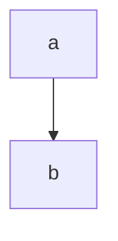

# How to print a PDF


Edit the following files:

- `~/.local/share/nvim/lazy/markdown-preview.nvim/app/_static/markdown.css`
- `~/.local/share/nvim/lazy/markdown-preview.nvim/app/_static/page.css`


add the following lines at the bottom:


```css
@media print {
  #page-header {
    display: none;
  }
  .markdown-body {
    background-color: #fff;
    border: none;
    color: none;
  }
  main {
    background-color: #fff;
  }
}
```


Mermaid example




