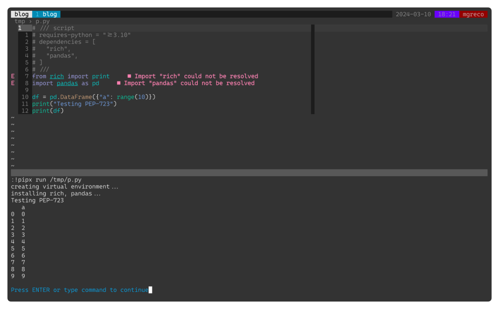

En mi camino hacia el minimalismo, hoy he tenido la oportunidad de probar cómo
funciona el [PEP-723][pep] y es bastante impresionante.

El PEP-723 define una sintaxis para declarar las dependencias que un script
Python necesita, permitiendo mantener todo definido en un único archivo.

Prueba esto, crea un archivo Python con el siguiente contenido:


```python
# /// script
# requires-python = ">=3.10"
# dependencies = [
#   "rich",
#   "pandas",
# ]
# ///
from rich import print
import pandas as pd

df = pd.DataFrame({"a": range(10)})
print("Testing PEP-723")
print(df)
```

> Nota: Observa el bloque de comentarios que define un script. Es básicamente
> el mismo contenido que incluirías en tu `pyproject.toml`.

a continuacion ejecuta:


```bash
pipx run /tmp/p.py
```





Mola eh!


[pep]: https://peps.python.org/pep-0723/
