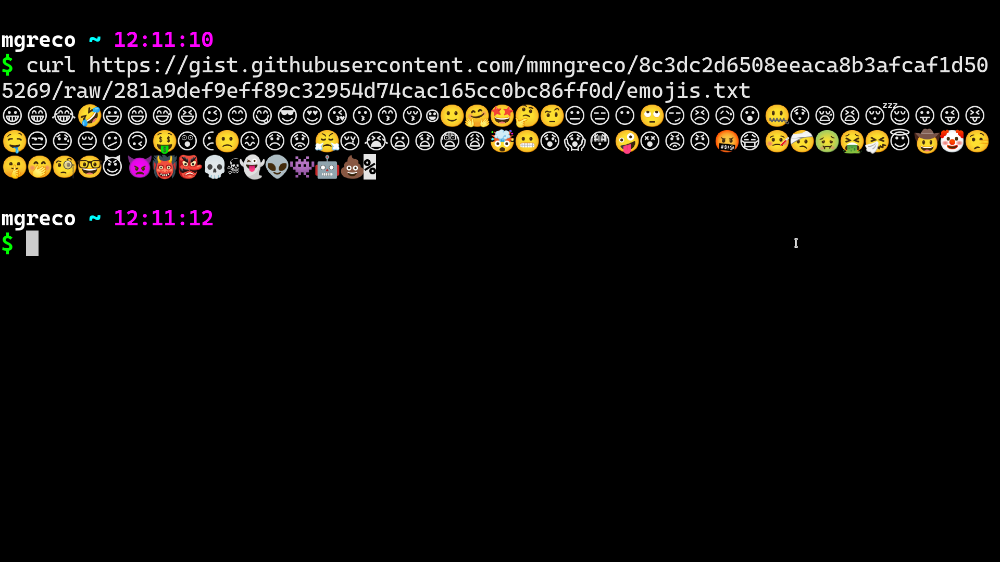

## The Context: Does this sound familiar?

I was working as usual when, after executing `black src`, my terminal just
vanished. There was no apparent reason for this. However, since I use tmux,
everything was still intact. I opened a new `st` terminal, but it was impossible
to attach the tmux session without causing a crash in `st`. The culprit?
[Emojis!][black-emojis]


> Note: For more information, check out this [video][video].

More evidence:

- [issue-1][issue-1]
- [issue-2][issue-2]
- [issue-3][issue-3]

## The problem

I'm not sure how other terminals handle this, but `st` uses `libxft` for
rendering emojis (and possibly other characters or even all?). It seems there's
an issue with this dependency, which is causing this annoying problem.

The solution is to use a more recent version of the library, specifically a
version higher than 2.3.4, which is known to have this issue. Once I realized
this was the root of the problem, I found a [PPA][ppa] for Ubuntu that has
[libxft-2.3.6][libxft]. After installing it, everything worked perfectly!

I should mention that emojis were the most common cause of errors, but I've
also encountered issues with other characters/symbols that can be easily typed
on your keyboard without you even realizing it.

## The fix

The fix primarily involves upgrading [libxft][libxft]. I know of two ways to
achieve this: one is to compile it yourself, and the other is to use
[this PPA][ppa]. I will go with the latter:"

```bash
sudo add-apt-repository ppa:suntong001/ppa
sudo apt update
sudo apt install libxft -y
```

Now check it out, open a new `st` instance and get a list of emojis from the
gist:

```bash
curl https://gist.githubusercontent.com/mmngreco/8c3dc2d6508eeaca8b3afcaf1d505269/raw/8d87d4f40b7fa6cb38e8413a8fad9e87984cd68e/emojis.txt
```

and there you go!




The emojis rendering is not perfect but the main goal is to avoid
those unexpected crashes and switches between terminals to keep working.


<!-- Links -->

[video]: https://www.youtube.com/watch?v=f9qNXV01yzg
[ppa]: https://launchpad.net/~suntong001/+archive/ubuntu/ppa
[symbola]: https://github.com/ChiefMikeK/ttf-symbola

[devto]: https://dev.to/suntong/st-the-suckless-simple-terminal-v09-4klf
[libxft]: https://gitlab.freedesktop.org/xorg/lib/libxft
[compile]: https://dmatos2012.github.io/blog/Installing-LibXft-bgra-on-ubuntu/

[issue-1]: https://www.reddit.com/r/archlinux/comments/byy647/st_sucklesssimple_terminal_and_emoji/
[issue-2]: https://www.reddit.com/r/suckless/comments/gp1xfk/st_find_cause_for_terminal_crash/
[issue-3]: https://github.com/LukeSmithxyz/voidrice/issues/284

[black-emojis]: https://github.com/psf/black/issues/223
