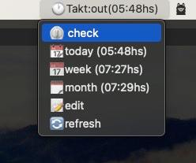

Hey there, fellow clicking enthusiasts!

Today, I want to share this little trick I found out to make life a bit easier
with [Takt](https://github.com/mmngreco/takt) on macOS. If you're like me and
want a convenient button to check in and out of work while also seeing useful
info about your hours, you're in for a treat.

> Note:
> `Takt` is a simple time tracking CLI I made to meet my needs.

So, a while back, I was using this dashboard widget called Übersicht. It was...
okay-ish. Decent. But something just didn't click. Enter SwiftBar—my shiny new
toy (and solution)!

Now, let’s dive right in and let me show you how awesome it is. Buckle up!

## What is SwiftBar?

Picture this: It’s like a Swiss army knife for your menu bar. Despite using
`yabai` and `skhd` (yeah, I know, fancy names), setting up shortcuts on macOS
compared to Linux plus i3—good luck! SwiftBar seems to bring a perfect
compromise.

## Getting Started: Bash + SwiftBar = ❤️

Once SwiftBar is installed, you need to create a plugin, which is basically a
bash script. Don’t worry if you’re not a script wizard. I’ve got you covered!

Here’s what I did:

I placed my plugin in `~/.swiftBar/plugins` because organization, right? Plus,
the filename and the number (`takt.1m.sh`, the '1m' indicates it refreshes
every minute!) are crucial in the SwiftBar world.

Let’s jump straight into the script:

```bash
#!/usr/bin/env bash

# Metadata
# <xbar.title>Takt: time manager</xbar.title>
# <xbar.version>v0.0</xbar.version>
# <xbar.author>Max Greco</xbar.author>
# <xbar.author.github>mmngreco</xbar.author.github>
# <xbar.desc>Takt: track your time like a pro!</xbar.desc>
# <xbar.image>???</xbar.image>
# <xbar.dependencies>bash</xbar.dependencies>
# Hide SwiftBar options from the menu
# <swiftbar.hideAbout>true</swiftbar.hideAbout>
# <swiftbar.hideRunInTerminal>true</swiftbar.hideRunInTerminal>
# <swiftbar.hideLastUpdated>true</swiftbar.hideLastUpdated>
# <swiftbar.hideDisablePlugin>true</swiftbar.hideDisablePlugin>
# <swiftbar.hideSwiftBar>true</swiftbar.hideSwiftBar>
# <swiftbar.environment>[EDITOR=vim, TAKT_FILE=/Users/mgreco/.takt-log/work.csv, ... ]</swiftbar.environment>

# Variables
last_st=$(/Users/mgreco/.local/bin/takt display | head -4 | tail -1 | tr -d "│" | awk '{print $3}')
last_hs=$(/Users/mgreco/.local/bin/takt summary | head -4 | tail -1 | tr -d "│" | awk '{print $4}')
last_wtd=$(/Users/mgreco/.local/bin/takt wtd | head -4 | tail -1 | tr -d "│" | awk '{print $4}')
last_mtd=$(/Users/mgreco/.local/bin/takt mtd | head -4 | tail -1 | tr -d "│" | awk '{print $4}')

# Title
echo "🕐Takt:${last_st}(${last_hs}hs)"
echo "---"

# Menu rows
echo "⏲️ check | bash=/Users/mgreco/.local/bin/takt param1=check terminal=false"
echo "📆today (${last_hs}hs) | bash=/Users/mgreco/.local/bin/takt param1=wtd terminal=true"
echo "📅week (${last_wtd}hs) | bash=/Users/mgreco/.local/bin/takt param1=wtd terminal=true"
echo "🗓️month (${last_mtd}hs) | bash=/Users/mgreco/.local/bin/takt param1=mtd terminal=true"
echo "📝edit | bash=/Users/mgreco/.local/bin/takt param1=edit terminal=true"
echo "🔄refresh | refresh=true"
```

With a few lines of bash, you can have your own Takt button on your menu bar.



This script does everything you need. It shows the current status and working
hours. It has buttons for checking times and viewing worked hours on different
time spans (daily, weekly, monthly). There’s also a refresh option and an edit
button to tweak the timestamp if needed.

So go ahead, give it a spin. Your macOS menu bar will thank you. Happy
clicking!

Cheers,
Max
